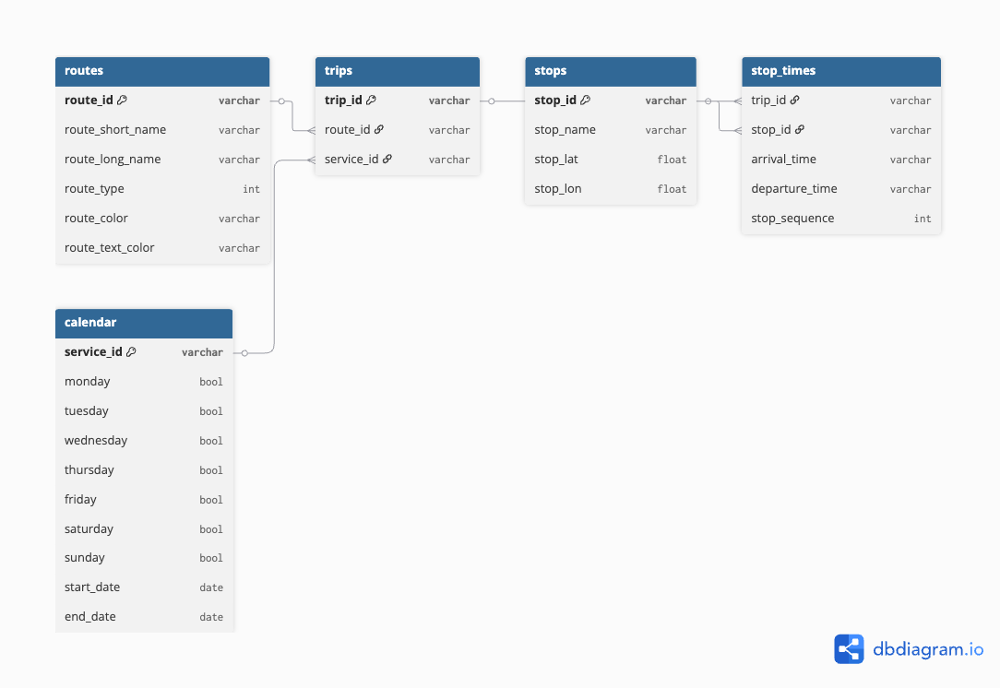

# UTA GTFS Schedule Data Model Summary  
**Author:** Chase Powers – *Data Discovery & Description Lead 

---

## Overview  
The Utah Transit Authority (UTA) General Transit Feed Specification (GTFS) **Schedule Feed** provides static, agency-wide data describing transit routes, trips, stops, and service calendars.  

This data model forms the foundation for downstream pipelines and dashboards related to:  
- Route performance  
- Real-time vehicle integration  
- On-time reliability analysis  
- Spatial analysis of stops and service patterns  

---

## Core Entities and Relationships  

### Key Relationships  
- A **route** has many **trips**  
- A **trip** has many **stop_times**  
- Each **stop_time** references one **stop**  
- A **calendar** entry defines service for multiple trips  

---

## Primary Join Keys  

| Key | Description |
|------|-------------|
| route_id | Connects routes ↔ trips |
| trip_id | Connects trips ↔ stop_times |
| stop_id | Connects stop_times ↔ stops |
| service_id | Connects calendar ↔ trips |

---

## Notes  
- **Source:** https://gtfsfeed.rideuta.com/GTFS.zip  
- **Format:** CSV files inside a ZIP archive  
- **Refresh frequency:** Updated periodically by UTA  
- **Ingestion:** Loaded into DuckDB during Week 1  
- **Relationships:** Fully documented in `data_dictionary.md` and visualized in the ER diagram  

---

## Summary  
This data model defines the core structure of UTA’s static GTFS information.  
Together with the data dictionary and discovery report, it establishes a complete foundation for Week 1 of the ingestion pipeline and all downstream analytics.